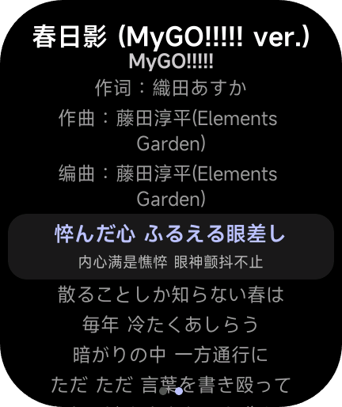
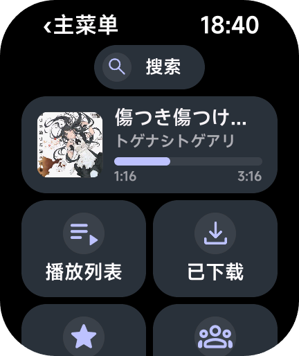
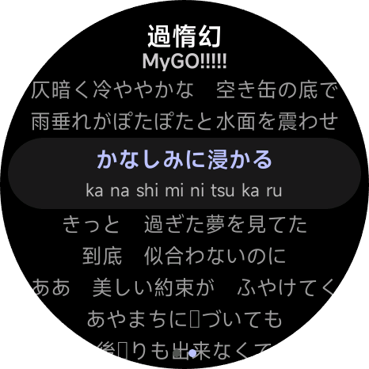
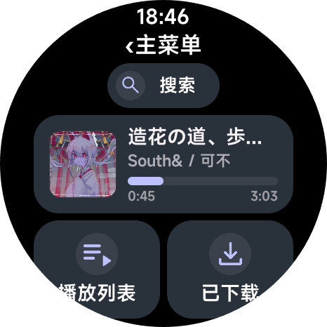
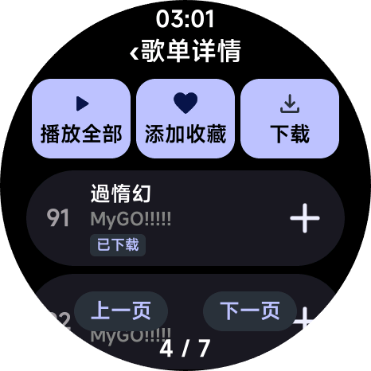

# NeoMusic

NeoMusic 是一款专为小米 VelaOS 手表打造的第三方音乐客户端，底层重构，功能焕新，新增本地导入支持
支持在线流媒体、批量下载、离线缓存、存储管理、每日推荐、私人 FM、快捷手势、多语种歌词和云控更新等功能
Lite 档 2.99 元可离线缓存 50 首，Plus 档 4.99 元可缓存 100 首，Pro 档 6.99 元可无限缓存

|  |  |
| --- | --- |
| 资源 ID | `moe.orpu.neomusic` |
| 类型 | 快应用（quick_app） |
| 作者 | OrPudding |
| 付费类型 | force_paid |
| 标签 | 音乐 / 实用工具 |

## 支持设备

- REDMI Watch 5（xmrw5）
- REDMI Watch 5 eSIM（xmrw5xring）
- REDMI Watch 6（xmrw6）
- Xiaomi Watch S3（xmws3）
- Xiaomi Watch S4（xmws4）
- Xiaomi Watch S4 41mm（xmws441）
- Xiaomi Watch S4 15th Anniversary（xmws4xring）
- Xiaomi Watch S5（xmws5）

## 下载

| 文件 | 版本 | 设备 |
| --- | --- | --- |
| [0-white_moe.orpu.neomusic.release.26.8.12.rpk](downloads/0-white_moe.orpu.neomusic.release.26.8.12.rpk) | 26.8.12 | REDMI Watch 5（xmrw5） REDMI Watch 5 eSIM（xmrw5xring） REDMI Watch 6（xmrw6） Xiaomi Watch S3（xmws3） Xiaomi Watch S4（xmws4） Xiaomi Watch S4 41mm（xmws441） Xiaomi Watch S4 15th Anniversary（xmws4xring） Xiaomi Watch S5（xmws5） |

## 预览

---

本仓库由 [OronBox 创作者中心](https://oronbox.zxor.org) 创建和维护。This repository is created and maintained by OronBox Creator Center.
